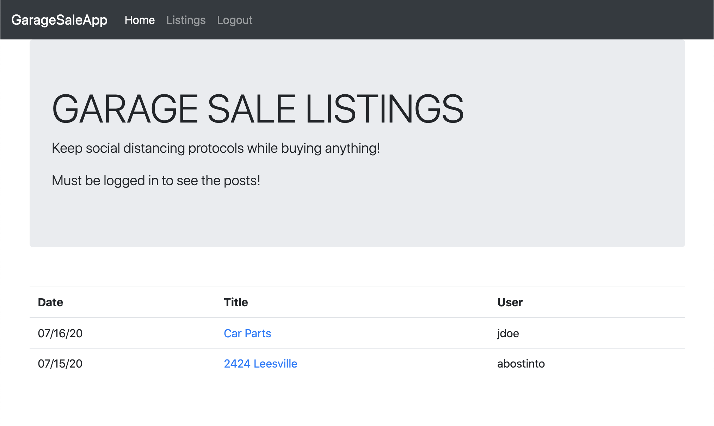
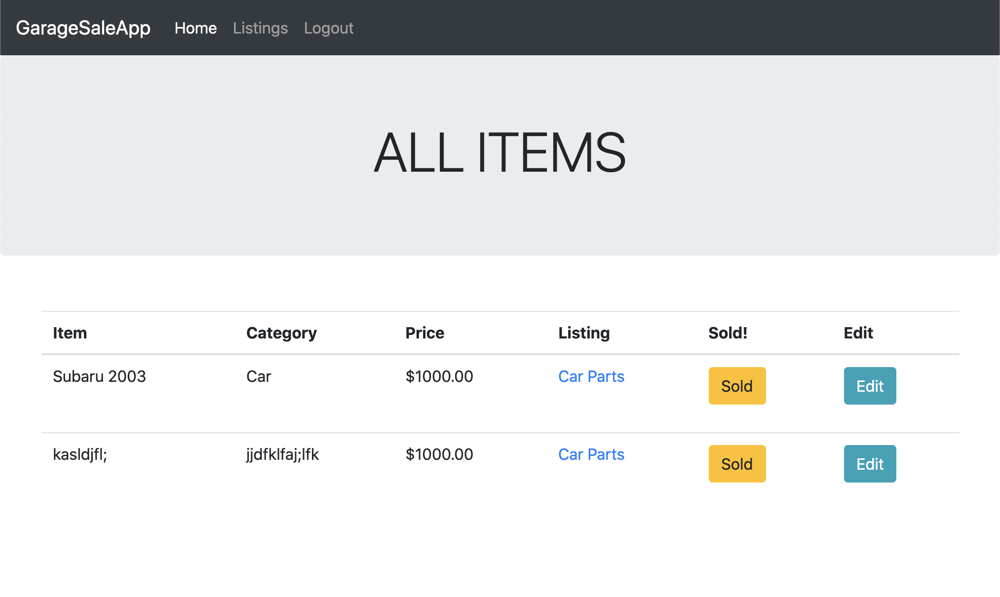
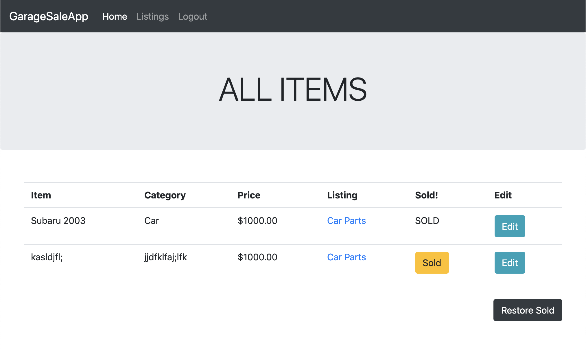
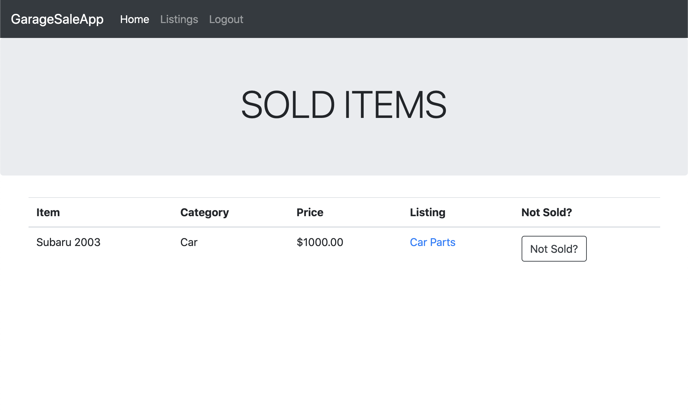

# Sinatra Project: Garage Sale App

Garage Sale is a social distancing application that allows inventory sale control.
The inspiration is craigslist classified with the ability to set an item as "Sold" in order to control inventory. 

Users are able to:

* Create Listings
* Add Items
* Mark item as Sold
* Restore Items Not Sold
* Contact Sellers

## Usage

* After cloning this repo, run 'bundle install' to install dependencies.

* To create your local database, run 'rake db:create' and 'rake db:migrate'.

* You can start the application (without secure connection) by running shotgun from the application root folder. Then in a browser, go to http://localhost:9393/ to begin.

## Screenshots

## Contributing

Bug reports and pull requests are welcome on GitHub at https://github.com/joshpled/garage_sale_app. This project is intended to be a safe, welcoming space for collaboration, and contributors are expected to adhere to the [Contributor Covenant](http://contributor-covenant.org) code of conduct.

## License

The application is available as open source under the terms of the [MIT License](https://opensource.org/licenses/MIT).